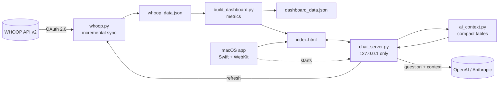

<div align="center">


# WHOOP Dashboard

**A private, data-first training dashboard built on your own WHOOP data.**
Sports-science metrics the WHOOP app doesn't show, a daily training call you can
check line by line, and an AI chat that knows your entire history.

[](https://github.com/jpselwan123/whoop-dashboard/actions/workflows/ci.yml)
[](LICENSE)


<sub>All screenshots use the built-in synthetic demo athlete — no real health data.</sub>

</div>

---

## Contents

- [Why this exists](#why-this-exists)
- [Features](#features)
- [Try it in 30 seconds (no WHOOP needed)](#try-it-in-30-seconds-no-whoop-needed)
- [Setup with your WHOOP](#setup-with-your-whoop)
- [AI chat](#ai-chat)
- [How the numbers work](#how-the-numbers-work)
- [Architecture](#architecture)
- [Privacy & security](#privacy--security)
- [Development](#development)
- [Limitations](#limitations)
- [License & disclaimer](#license--disclaimer)

## Why this exists

The WHOOP app tells you *what* your recovery and strain are. It doesn't tell you
whether your training load is ramping too fast, whether this week has been
hard-every-day, which sport actually costs you the most recovery, or *why* today is
a good or bad day to push — in numbers you can check.

This dashboard pulls your full history straight from the official WHOOP API and
answers those questions. Every call it makes shows the exact numbers and thresholds
behind it, compared with **your own** history — and every rule and threshold comes from
published research, cited below. Where a study doesn't give a number, the dashboard doesn't
invent one.

## Features

### Daily — today's call
- **Readiness** — one score from your 7-day HRV, resting HR and sleep, each against your previous
  4 weeks and then placed among your own days (50 = your median day), with the day's plan:
  **Train as planned · Go easy · Rest**. Once you have trained, the plan is spent and
  the card says **"N sessions logged: matched the plan"** (or **"above the plan"**).
- **Click the orb** to see every measure next to its normal range, the answer lines, and last
  night's numbers as information.
- **Warning signs** — HRV or resting HR outside your normal range. Breathing rate is shown next
  to your usual but never changes the plan (no study gives a numeric rise worth acting on).
- **Today's plan** — hard-training or easy-day advice, sleep (nights with 7+ hours), the last
  day without a workout.

### Weekly — load and injury-risk signals


- **Acute:Chronic Workload Ratio** with safe / caution / high-risk bands.
- **Training variety** (Foster monotony) — warns when a week had almost the same training
  load every day.
- Heart-rate zone time in research zones (strength sessions left out — their rest between sets
  would count as easy), sessions per week, training mix, sleep composition — all on
  Monday–Sunday weeks.

### Monthly — long-range trends


- **Recovery calendar heatmap** of every day on record.
- **Recovery cost by sport** — one row per sport against your other training days, with your 4
  most-played shown and the rest in a dropdown; gaps that could be chance say so.
- Trend explorer for any metric including readiness, personal records, and the full training log.

### App experience
- **Native macOS app** (Swift + WebKit) that refreshes on launch.
- **Manual refresh** button — nothing updates behind your back.
- **AI chat** with full-history context (OpenAI or Claude), conversation memory,
  and a draggable panel.
- Works on phone-width screens, respects *Reduce Motion*, no external JS libraries.

Items marked **Beyond WHOOP** in the app are metrics the WHOOP app doesn't provide.

## Try it in 30 seconds (no WHOOP needed)

Requires Python 3.9+ (preinstalled on recent macOS). No packages to install.

```bash
git clone https://github.com/jpselwan123/whoop-dashboard.git ~/whoop
cd ~/whoop
python3 scripts/generate_demo_data.py demo   # synthetic athlete, 420 days
python3 build_dashboard.py demo
open demo/index.html
```

## Setup with your WHOOP

### 1. Create a WHOOP developer app

1. Sign in at [developer.whoop.com](https://developer.whoop.com) and create an app.
2. Add a redirect URI. The default this project uses is
   `https://localhost:8080/callback` (set `WHOOP_REDIRECT_URI` in `.env` to use another).
3. Select the scopes: `read:recovery`, `read:cycles`, `read:sleep`, `read:workout`,
   `read:profile`, `read:body_measurement`.
4. Copy the **Client ID** and **Client Secret**.

### 2. Configure

```bash
cd ~/whoop
cp .env.example .env
```

Put your Client ID and Client Secret into `.env`.

### 3. Authorize once

```bash
python3 whoop.py --auth-url
```

Open the printed link, approve access, then copy the `code=` value from the address
bar you land on (the page itself may not load — that's expected) into
`WHOOP_AUTH_CODE` in `.env`. The code is single-use and expires within minutes.

### 4. First pull

```bash
./refresh.sh          # = python3 whoop.py && python3 build_dashboard.py
open index.html
```

The first run downloads your full history. After that, a refresh token is stored in
`whoop_tokens.json`, the auth code is never needed again, and each refresh only
re-fetches the last 10 days (to catch late score corrections).

### 5. Native macOS app (optional)

```bash
./native_app/build.sh
mv "native_app/build/WHOOP Dashboard.app" /Applications/
```

The app expects the project at `~/whoop`. It isn't signed with a paid Apple
Developer ID, so the **first time**, right-click the app and choose **Open**, then
confirm. After that it opens normally.

## AI chat

Click the pulse icon (bottom right) to ask anything about your data — *"How does
soccer affect my next-day HRV?"*, *"Compare my sleep this month to last month"*,
*"Why was I flagged today?"*

| | OpenAI (default) | Anthropic |
|---|---|---|
| Model | `gpt-5.6-luna` | `claude-sonnet-5` |
| `.env` | `OPENAI_API_KEY=…` | `AI_PROVIDER=anthropic`<br>`ANTHROPIC_API_KEY=…` |
| Key from | [platform.openai.com](https://platform.openai.com/api-keys) | [console.anthropic.com](https://console.anthropic.com) |

- **Full context, compact.** Your whole history is sent as compact tables (every
  day, sleep, and workout plus the dashboard's computed numbers) — roughly 90% smaller
  than the raw WHOOP export. It stays well below the 272K-token
  point where OpenAI's long-context pricing starts.
- **Cheap.** With `gpt-5.6-luna` ($0.20 / 1M input tokens, $0.02 cached), a question
  typically costs around a cent; follow-ups reuse the cached context.
- **Conversation memory** within the open chat; the pencil icon starts a new one.
- **Key changes apply immediately** — `.env` is re-read on every question.
- Clear, plain-English errors for a missing/invalid key, no credit, rate limits,
  timeouts, and connection problems.

Set a monthly spending limit in your provider's billing settings. Model and
reasoning effort are configurable: `OPENAI_MODEL`, `OPENAI_REASONING_EFFORT`,
`ANTHROPIC_MODEL`.

## How the numbers work

Every rule and threshold below comes from a published study or consensus statement. Where the
papers leave a detail open, the dashboard follows the original method paper they cite, and
says so.

### Readiness

One number for how ready you are to train today, on a scale of **your own days**: 50 is a median
day for you, 90 means only one day in ten of yours has been better. It is not a percentage of
anything, and it is not comparable between people.

| Step | What the dashboard does | Source |
|---|---|---|
| Measures | ln(RMSSD) HRV, resting HR and hours asleep (naps included) — each over the **last 7 days** and for **last night** alone: 6 standard scores | HRV: [Plews et al., 2012](https://link.springer.com/article/10.1007/s00421-012-2354-4), [2014](https://www.researchgate.net/publication/259319333_Monitoring_Training_With_Heart-Rate_Variability_How_Much_Compliance_Is_Needed_for_Valid_Assessment); resting HR: [Alfonso et al., 2025](https://www.nature.com/articles/s41598-025-13540-z); sleep: [Craven et al., 2022](https://pubmed.ncbi.nlm.nih.gov/35708888/); single days for short-term response: [Schneider et al., 2019](https://pmc.ncbi.nlm.nih.gov/articles/PMC6538885/), [Kiviniemi et al., 2007](https://pubmed.ncbi.nlm.nih.gov/17849143/), [Nuuttila et al., 2024](https://pmc.ncbi.nlm.nih.gov/articles/PMC11541970/) |
| Your normal | The 4 weeks before the current week, updated weekly: 7-day averages compared with the spread of 7-day averages, last night compared with the spread of single nights; mean ± 0.5 SD (sample SD) is "normal" | [Vesterinen et al., 2016](https://jyx.jyu.fi/jyx/Record/jyx_123456789_50625); [Javaloyes et al., 2019](https://pubmed.ncbi.nlm.nih.gov/29809080/) — tabulated in [Manresa-Rocamora et al., 2021](https://pmc.ncbi.nlm.nih.gov/articles/PMC8507742/); weekly update: [Carrasco-Poyatos et al., 2020](https://pmc.ncbi.nlm.nih.gov/articles/PMC7432021/) |
| One score | All six standard scores (resting HR flipped, so lower is better) averaged with equal weights | Standard-score composites for athlete monitoring: [Thornton et al., 2019](https://pubmed.ncbi.nlm.nih.gov/30676144/); equal weights when none are validated: [Dawes, 1979](https://www.researchgate.net/publication/232597503_The_robust_beauty_of_improper_linear_models_in_decision_making) |
| The spread it is measured against | All of your earlier scored days, not a rolling window. Days are strongly dependent (day-to-day correlation 0.87), so 530 days behave like an effective **n ≈ 73** and the spread estimate is good to about **±8%**; a 90-day window would be ±20% and would change the plan on 10% of days — noise in the ruler, not a change in you | Standard adjustment for autocorrelated samples |
| On a readable scale | Averaging standard scores shrinks their spread — the measures move together, but not exactly — so the average is **not** on a 1-SD-per-unit scale of its own (measured here: 0.80 SD over 530 days, which made a genuinely above-normal day read as average). The average is standardised against the spread of your own earlier scores and shown as a percentile of them | Standardising a composite before applying SD cut-offs: Thornton 2019. The percentile itself is the normal curve (Φ), not a choice — no study prescribes a display scale, so nothing here is invented: the lines stay exactly the trials' SD lines |
| Today's plan | **31+** — at or above the bottom of the normal band → **Train as planned** (the trials' prescribed moderate/high session); below the band → **Go easy** or **Rest**. There is no separate answer for being *above* the band, because no cited trial prescribes one: Kiviniemi 2007 gives high intensity on "an increase **or no change**", Javaloyes 2019 on "above **or within** the SWC", Vesterinen 2016 programmes the moderate/high session when HRV is **within** it, and the review of the trials says high intensity "within or above baseline ranges". **7–30** → Go easy, under **7** → Rest. Over 530 days the bands caught 66.6% / 27.2% / 6.2% of days, against the 69.1 / 24.2 / 6.7% the SD lines correspond to. That is a check that **the scale is built correctly**, not evidence the score predicts anything: a percentile puts a known fraction either side of each line. **Those percentages are the readiness series alone** — the score and its band lines, nothing that reacts to today's live state (they are not the share of days the card finally showed, which the rest rules below change). The gap at the top line is the composite's mild left skew (−0.26) plus a standardised mean of −0.05, because each day is scored against earlier days only | **−0.5 SD** is the smallest worthwhile change used in the trials ([Vesterinen et al., 2016](https://jyx.jyu.fi/jyx/Record/jyx_123456789_50625); [Javaloyes et al., 2019](https://pubmed.ncbi.nlm.nih.gov/29809080/); [Kiviniemi et al., 2007](https://pubmed.ncbi.nlm.nih.gov/17849143/)). **−1.5 SD is our own extension** — the "worth acting on" line attributed to Thornton 2019 could not be verified in the paper |
| Go easy or rest | Below the band the trials prescribe "low intensity exercise (or passive rest)". Rest when the fall is **large** (under 7) or **sustained** — the **second day in a row** below your normal. Never more than **2 rest days in a row** | "Low intensity exercise (or passive rest) … when values are suppressed": [Manresa-Rocamora et al., 2021](https://pmc.ncbi.nlm.nih.gov/articles/PMC8507742/). The 2-day count is **adapted from** [Kiviniemi et al., 2007](https://pubmed.ncbi.nlm.nih.gov/17849143/) ("decreasing trend for 2 days" → low intensity or rest), with two differences stated plainly: his 2 days are two successive **drops in HRV**, not two days below the range, and he prescribed "low intensity **or** rest" without choosing between them — **the split between easy and rest is ours**. He also measured HF power, not ln rMSSD. **Both rules were measured on this history** (`scripts/check_doc_stats.py`, `rest_rules`): the implemented one triggers on **134 of 531 days (25.2%)** *(before the rest cap)*, Kiviniemi's literal one — HRV lower today than yesterday and yesterday than the day before — on **100 (18.8%)**, and they **disagree on 178 days (33.5%)**, agreeing on only 28. Both are evaluated for the same day, so the counts are comparable. After the two-in-a-row cap the plan actually says Rest on **19.2%** of days. The literal rule is measured, not applied. Rest cap: "will not accumulate more than two consecutive rest sessions", [Carrasco-Poyatos et al., 2020](https://pmc.ncbi.nlm.nih.gov/articles/PMC7432021/) — **a published trial protocol, not a result** |
| Breathing rate | Last night against your usual (average of nights 30–90 days before, 30+ nights), **reported and never acted on**. The old "3+ breaths/min → Rest" rule was ours, not Natarajan's — the paper scores a standardised deviation from a rolling baseline and gives no numeric rise — and over the 493 nights with enough baseline to judge it never once fired (largest rise +2.3/min) | [Natarajan et al., 2021](https://pmc.ncbi.nlm.nih.gov/articles/PMC8443549/) |
| Through the day | Every refresh recomputes the load ratio with today's **training load** (Edwards TRIMP) so far, and the card says how much room is left before the caution line ("passes 1.3 if today's training load goes over 340") — the load that puts the ratio exactly on the line, solved from the same 7- and 28-day averages. **The ratio is reported and never acts on the plan.** It used to step the plan down to Go easy past 1.5; it no longer does. An acute:chronic ratio is a mean over calendar days, and this schedule has many days with no training at all, which swings the ratio far harder than it does for the near-daily squads Gabbett's bands were drawn from — here it sits above 1.5 on **15.7%** of days (median 1.01, highest 3.69). A nap changes readiness itself, because hours asleep count naps. "Today" is the current WHOOP day, from one sleep to the next | Load-ratio bands: [Gabbett, 2016](https://bjsm.bmj.com/content/50/5/273) — disputed as an injury predictor: [Impellizzeri et al., 2020](https://pubmed.ncbi.nlm.nih.gov/32502973/) |
| After training | Readiness is an overnight measurement, so a session cannot change this morning's number — it lowers the next one. Measured on your own history: the next day's standardised composite regressed on today's score and today's strain (Newey-West errors, lag 7, because days are dependent). The effect is real — **−0.025 per strain point, p < 0.001, 527 day pairs** — but it **fails two of its three gates**: it is not even across strain terciles (−0.063 / +0.009 / −0.166, which rises in the middle), and fitted on the first 70% of days it predicted the last 30% of next-morning scores *worse* than doing nothing (mean error 12.0 vs 11.4). **The adjusted score is not shown**, and turns itself on only if both reverse. Both the outcome and the control are the **standardised** composite, so the coefficient is in the unit it is later added to — regressing the raw night composite instead, as this did until recently, produced a number in one unit and applied it in another | Our own measurement, labelled as an extension — no published model prescribes this |
| What the score would have been | A slider in the readiness panel for last night's hours asleep, from your own shortest to longest night of the last year. It re-evaluates **the same formula** — the same six standard scores, the same average, the same percentile step — with one input replaced, in the page, from figures already on it. Only last night's score moves: the 7-day part of the score stops at yesterday, which is why last night is counted once rather than twice. It is history, not a forecast: what today's score *would have been*, never what tomorrow will be | No new rule or threshold — `build_what_if` exports the existing baselines and `whatIfScore` re-runs `percentile_series`' arithmetic; a test asserts the slider at last night's real value returns the displayed score |
| What moves your readiness | Six things about a day — hours asleep, bedtime against your own median, day strain, whether you napped, when the last session finished, days since a rest day — each fitted **on its own** against the next morning's standardised score, controlling for that day's score, with Newey-West errors (lag 7) for the dependence between days. A candidate is shown only if it passes **the same three gates** as the training-cost adjustment: significant at p < 0.05, even across its own terciles rather than one jump, and — fitted on the first 70% of days — better than doing nothing on the last 30%. On this history **one of six** passes: a point of day strain is worth **−1 point** on the next morning, over 527 days, and it beat doing nothing on 159 held-out days by **0.01 points**, which the card states plainly as "barely". Effects are converted to readiness points through the same normal curve the score uses | Our own measurement, labelled as one. Gates and errors as in `build_training_cost`; nothing here is a published rule, and nothing acts on the plan |
| Session today | The plan is **one session a day** — the trials read HRV each morning and set that day's session. Once you have trained, the card shows **“N sessions logged: matched the plan”** (or **“above the plan”**); recovery takes ~24 h after a low or moderate session and ~48 h after a hard one | Daily prescription: Kiviniemi 2007, Vesterinen 2016, Javaloyes 2019; recovery time: [Stanley, Peake & Buchheit, 2013](https://link.springer.com/article/10.1007/s40279-013-0083-4) |

Last night is three of the six inputs and the previous 7 days are the other three, but **equal weights
do not make them equal halves**. Measured over 530 days, the trend inputs carry **62%** of the score's
variance and last night **38%**, because the trend z-scores move more (SD 1.4–1.6) than the single-night
ones (1.1–1.2): HRV 26% / resting heart rate 26% / sleep 9% on the trend side, 17% / 18% / 4% for last
night. HRV and resting heart rate correlate **0.93**, so between them they are **87%** of the score and
sleep is **13%** of it.

The trend window stops the day before, so each night enters once. Counting last night in the trend
average as well pushed its weight to about 57%. On this history the de-duplication is worth about
**1 percentage point of plan changes** (34% → 33%, measured like-for-like) and a smoother score
(day-to-day correlation 0.81 → 0.87); the larger drop reported earlier came from merging the plan
states, not from this fix. The score needs
**8 weeks**: 4 to learn what is normal for each measure, then 4 more to learn how much your own score
moves. The raw values and
WHOOP recovery are shown next to the score.

### Other metrics

| Metric | Definition | Source |
|---|---|---|
| **Intensity zones** | Easy below ~82% of max HR, moderate 82–87%, hard above 87%. WHOOP's zones are % of heart-rate *reserve*, so each is converted with your resting and max HR and its minutes split across the lines in proportion. A session's intensity is where most of its time was. | [Seiler & Kjerland, 2006](https://pubmed.ncbi.nlm.nih.gov/16430681/); Seiler 2010; [WHOOP zones use heart-rate reserve](https://www.whoop.com/us/en/thelocker/why-whoop-uses-heart-rate-reserve-not-max-heart-rate/) |
| **Training variety** | Foster's monotony = a week's mean daily training load ÷ its SD, 0 on days without training, complete weeks only; above 2.0 flagged. Training load = Edwards' TRIMP (minutes at 50–60 / 60–70 / 70–80 / 80–90 / 90–100% of max HR × 1–5), because WHOOP doesn't record Foster's session RPE and strain (a logarithmic 0–21 scale) can't be added across sessions. The chart shows your WHOOP day strain. | [Foster et al., 2001](https://www.researchgate.net/publication/11645805_A_New_Approach_to_Monitoring_Exercise_Training); Edwards 1993 |
| **Load ratio (ACWR)** | Average **Edwards TRIMP** over the last 7 calendar days ÷ last 28 (21+ days of data); bands 0.8 / 1.3 / 1.5. Not WHOOP day strain: Gabbett's bands were derived on linear loads, and over 568 days the strain ratio never once reached 1.5 (highest 1.48, SD 0.17), so the top band was unreachable | Gabbett 2016 — predictive value disputed by [Impellizzeri et al., 2020](https://www.researchgate.net/publication/341936245_AcuteChronic_Workload_Ratio_Conceptual_Issues_and_Fundamental_Pitfalls) |
| **Sleep** | Nights in the last 7 with 7+ hours asleep | [AASM & Sleep Research Society, Watson et al., 2015](http://jcsm.aasm.org/doi/10.5664/jcsm.4758) |
| **Rest day** | The last finished day with no logged workout — a fact, no threshold | — |
| **Sport recovery cost** | One row per sport: next-morning recovery after days that sport was your hardest session, vs all your other training days, with the intensity most of those days were. Your 4 most-played sports are shown, the rest in a dropdown; a gap counts as real only with 30+ days on both sides and Welch's t-test p < 0.05, otherwise the number is prefixed with ~ | Standard statistical conventions |
| **Does following the plan pay off?** | Not on the page — the comparison exists but cannot be tested here. Next-morning recovery after days the plan was followed (519 days → 51.7) against days a moderate or high-intensity session was done on a **Go easy** or **Rest** day (**7 days** → 31.4). Seven override days is far below the 30 needed, so no claim is made, and the card was removed rather than show a number that means nothing. Comparing the score with WHOOP recovery was dropped too: recovery is built from the same HRV and resting heart rate. `scripts/analyse_plan_effect.py` runs the question properly offline, on the next night's own composite with Newey-West errors: a session costs **−0.150 SD per intensity step** (t = −3.20), and the cost does not depend on how ready you were (interaction t = +0.17) | Standard statistical conventions; dependence between days handled with Newey-West errors |
| **▲▼ vs 30-day average** | Shown after 28 days; "= avg" when within ±0.5 SD of the last 30 days | Same smallest-worthwhile-change line as the protocol |

**Honest limits.** The pooled evidence for HRV-guided training is weak: in the meta-analysis
([Manresa-Rocamora et al., 2021](https://pmc.ncbi.nlm.nih.gov/articles/PMC8507742/)) it beat
predefined training on cardiorespiratory fitness by SMD 0.20 (95% CI −0.07 to 0.47) and on endurance
performance by 0.20 (−0.09 to 0.48) — neither significant — with only vagal HRV reaching significance
(SMD 0.50, 0.09 to 0.91), across small trials. This dashboard implements a method whose benefit is
not established. The protocol comes from endurance-athlete trials that measured HRV on waking;
WHOOP measures it during sleep (overnight values track training at least as well —
[Nuuttila et al., 2024](https://pmc.ncbi.nlm.nih.gov/articles/PMC11541970/)). Equal weights and standard-score composites are usual ways to combine
measures, not weights validated for this purpose — and equal weights do not produce equal influence
(measured: HRV 26%, resting HR 26%, sleep 9% on the trend side; 17% / 18% / 4% for last night).
Reading the composite as a percentile assumes your days are **normally** distributed, not merely
symmetric. They are close but not normal: skewness −0.26, excess kurtosis +0.20. The bands therefore
land near their targets rather than on them — 66.6% above the lower line where the normal curve says
69.1%, and 6.2% below the rest line where it says 6.7%. Zone
conversion assumes minutes are evenly spread inside each WHOOP zone. Self-reported well-being, which
the trials also used, isn't available from the WHOOP API.

## Architecture



```
whoop-dashboard/
├── whoop.py                  # WHOOP OAuth + incremental data sync
├── build_dashboard.py        # all metrics; renders index.html from the template
├── dashboard_template.html   # the dashboard UI (vanilla JS + hand-built SVG charts)
├── chat_server.py            # local server: AI chat, refresh, data endpoint
├── ai_context.py             # full history → compact tables for the AI model
├── env_config.py             # .env loader + atomic file writes
├── refresh.sh                # pull + build in one step
├── CLAUDE.md                 # conventions for AI coding agents
├── native_app/               # macOS app (main.swift, build.sh, icon)
├── scripts/
│   ├── generate_demo_data.py # synthetic WHOOP export for demo + tests
│   └── privacy_scan.py       # blocks commits containing personal data
├── tests/                    # unit tests (no network, no secrets)
└── docs/screenshots/
```

**Design choices**
- **Zero dependencies** — Python standard library and plain browser APIs only.
  Nothing to install, nothing to go out of date.
- **Crash-safe writes** — every data file is written to a temp file and atomically
  renamed, so a force-quit can't corrupt your history or OAuth tokens.
- **Fail-safe UI** — animations never gate visibility; an empty or brand-new account
  shows clear "not enough data yet" states instead of broken charts.

## Privacy & security

- **Local-first.** Your data is stored only on your Mac. The only network calls go to
  WHOOP (to fetch your data) and — only when you ask the chat something — to the AI
  provider you configured.
- **Secrets never leave the backend.** API keys are read by the local server and never
  reach the web page. The server listens on `127.0.0.1` only.
- **What the chat sends:** your history as tables plus the conversation. It does
  **not** include your email, last name, WHOOP user ID, or record IDs. OpenAI requests
  are sent with `store: false`. Conversations are kept only in the open window.
- **Nothing personal is committed.** `.env`, `whoop_tokens.json`, and all generated
  data files are git-ignored. Tests and screenshots use synthetic data only.

See [SECURITY.md](SECURITY.md) to report a vulnerability.

## Development

```bash
python3 -m unittest discover -s tests -t tests -v
```

The test suite runs on synthetic data against a fake AI provider — no network, no
API keys, no cost. It covers metric calculations and edge cases (no workouts, missing
vitals, brand-new accounts), the privacy of the AI context, and the chat backend's
request format, conversation handling, input validation, and error messages.
GitHub Actions runs it on Python 3.9 and 3.12 and compiles the macOS app on every
push.

Before publishing changes, run the privacy scan — it fails if any tracked file contains
a value from your `.env`, your WHOOP tokens, identifiers from your own WHOOP export, or a
home-directory path:

```bash
python3 scripts/privacy_scan.py
```

`CLAUDE.md` documents the codebase conventions for AI coding agents.

## Limitations

- The native app is macOS-only; the dashboard itself works in any modern browser.
- The app isn't notarized (that needs a paid Apple Developer account), hence the
  one-time right-click → Open.
- The local server uses port `8934`; if something else uses it, change `PORT` in
  `chat_server.py` and the matching URLs in `dashboard_template.html`.
- Sport comparisons and the plan-effect analysis are correlations, not controlled experiments.
- Intensity zones depend on the max heart rate stored in your WHOOP profile; if it's wrong, zones shift.

## License & disclaimer

[MIT](LICENSE).

This is an independent personal project. It is **not affiliated with, endorsed by,
or supported by WHOOP, Inc.** "WHOOP" is a trademark of WHOOP, Inc., used here only
to describe compatibility with its public API.

This software is for fitness self-tracking and **is not medical advice**. It does not
diagnose, treat, or prevent any condition. Talk to a qualified professional about
health concerns.
