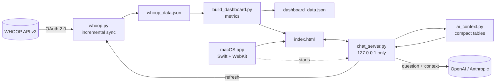

<div align="center">


# WHOOP Dashboard

**A private, data-first training dashboard built on your own WHOOP data.**
Sports-science metrics the WHOOP app doesn't show, a daily training call you can
check line by line, and an AI chat that knows your entire history.

[](https://github.com/jpselwan123/whoop-dashboard/actions/workflows/ci.yml)
[](LICENSE)


<sub>All screenshots use the built-in synthetic demo athlete — no real health data.</sub>

</div>

---

## Contents

- [Why this exists](#why-this-exists)
- [Features](#features)
- [Try it in 30 seconds (no WHOOP needed)](#try-it-in-30-seconds-no-whoop-needed)
- [Setup with your WHOOP](#setup-with-your-whoop)
- [AI chat](#ai-chat)
- [How the numbers work](#how-the-numbers-work)
- [Architecture](#architecture)
- [Privacy & security](#privacy--security)
- [Development](#development)
- [Limitations](#limitations)
- [License & disclaimer](#license--disclaimer)

## Why this exists

The WHOOP app tells you *what* your recovery and strain are. It doesn't tell you
whether your training load is ramping too fast, whether this week has been
hard-every-day, which sport actually costs you the most recovery, or *why* today is
a good or bad day to push — in numbers you can check.

This dashboard pulls your full history straight from the official WHOOP API and
answers those questions. Every call it makes shows the exact numbers and thresholds
behind it, compared with **your own** history — and every rule and threshold comes from
published research, cited below. Where a study doesn't give a number, the dashboard doesn't
invent one.

## Features

### Daily — today's call
- **Today's answer: Train hard · Easy or rest** — the decision rule from HRV-guided training
  trials, using your 7-day HRV and resting HR against your previous 4 weeks.
- **Click the orb** (your 7-day HRV) to see every rule next to its limit, and last night's
  numbers as information.
- **Warning signs** — HRV or resting HR outside your normal range, or breathing rate 3+ above
  your usual (a published illness sign).
- **Today's plan** — hard-training or easy-day advice, sleep (nights with 7+ hours), the last
  day without a workout.

### Weekly — load and injury-risk signals


- **Acute:Chronic Workload Ratio** with safe / caution / high-risk bands.
- **Training variety** (Foster monotony) — warns when a week had almost the same training
  load every day.
- Heart-rate zone time in research zones (strength sessions left out — their rest between sets
  would count as easy), sessions per week, training mix, sleep composition — all on
  Monday–Sunday weeks.

### Monthly — long-range trends


- **Recovery calendar heatmap** of every day on record.
- **Does this work?** — average next-morning recovery after "Train hard" vs "Easy or rest"
  days, and whether the gap passes a standard significance test. A consistency check
  (recovery shares HRV and resting HR with the answer), not independent proof.
- **Recovery cost by sport, at the same intensity** — each sport compared only with days of
  the same intensity; gaps that could be chance are faded.
- Trend explorer for any metric, personal records, and the full training log.

### App experience
- **Native macOS app** (Swift + WebKit) that refreshes on launch.
- **Manual refresh** button — nothing updates behind your back.
- **AI chat** with full-history context (OpenAI or Claude), conversation memory,
  and a draggable panel.
- Works on phone-width screens, respects *Reduce Motion*, no external JS libraries.

Items marked **Beyond WHOOP** in the app are metrics the WHOOP app doesn't provide.

## Try it in 30 seconds (no WHOOP needed)

Requires Python 3.9+ (preinstalled on recent macOS). No packages to install.

```bash
git clone https://github.com/jpselwan123/whoop-dashboard.git ~/whoop
cd ~/whoop
python3 scripts/generate_demo_data.py demo   # synthetic athlete, 420 days
python3 build_dashboard.py demo
open demo/index.html
```

## Setup with your WHOOP

### 1. Create a WHOOP developer app

1. Sign in at [developer.whoop.com](https://developer.whoop.com) and create an app.
2. Add a redirect URI. The default this project uses is
   `https://localhost:8080/callback` (set `WHOOP_REDIRECT_URI` in `.env` to use another).
3. Select the scopes: `read:recovery`, `read:cycles`, `read:sleep`, `read:workout`,
   `read:profile`, `read:body_measurement`.
4. Copy the **Client ID** and **Client Secret**.

### 2. Configure

```bash
cd ~/whoop
cp .env.example .env
```

Put your Client ID and Client Secret into `.env`.

### 3. Authorize once

```bash
python3 whoop.py --auth-url
```

Open the printed link, approve access, then copy the `code=` value from the address
bar you land on (the page itself may not load — that's expected) into
`WHOOP_AUTH_CODE` in `.env`. The code is single-use and expires within minutes.

### 4. First pull

```bash
./refresh.sh          # = python3 whoop.py && python3 build_dashboard.py
open index.html
```

The first run downloads your full history. After that, a refresh token is stored in
`whoop_tokens.json`, the auth code is never needed again, and each refresh only
re-fetches the last 10 days (to catch late score corrections).

### 5. Native macOS app (optional)

```bash
./native_app/build.sh
mv "native_app/build/WHOOP Dashboard.app" /Applications/
```

The app expects the project at `~/whoop`. It isn't signed with a paid Apple
Developer ID, so the **first time**, right-click the app and choose **Open**, then
confirm. After that it opens normally.

## AI chat

Click the pulse icon (bottom right) to ask anything about your data — *"How does
soccer affect my next-day HRV?"*, *"Compare my sleep this month to last month"*,
*"Why was I flagged today?"*

| | OpenAI (default) | Anthropic |
|---|---|---|
| Model | `gpt-5.6-luna` | `claude-sonnet-5` |
| `.env` | `OPENAI_API_KEY=…` | `AI_PROVIDER=anthropic`<br>`ANTHROPIC_API_KEY=…` |
| Key from | [platform.openai.com](https://platform.openai.com/api-keys) | [console.anthropic.com](https://console.anthropic.com) |

- **Full context, compact.** Your whole history is sent as compact tables (every
  day, sleep, and workout plus the dashboard's computed numbers) — roughly 90% smaller
  than the raw WHOOP export. It stays well below the 272K-token
  point where OpenAI's long-context pricing starts.
- **Cheap.** With `gpt-5.6-luna` ($0.20 / 1M input tokens, $0.02 cached), a question
  typically costs around a cent; follow-ups reuse the cached context.
- **Conversation memory** within the open chat; the pencil icon starts a new one.
- **Key changes apply immediately** — `.env` is re-read on every question.
- Clear, plain-English errors for a missing/invalid key, no credit, rate limits,
  timeouts, and connection problems.

Set a monthly spending limit in your provider's billing settings. Model and
reasoning effort are configurable: `OPENAI_MODEL`, `OPENAI_REASONING_EFFORT`,
`ANTHROPIC_MODEL`.

## How the numbers work

Every rule and threshold below comes from a published study or consensus statement. Where the
papers leave a detail open, the dashboard follows the original method paper they cite, and
says so.

### Today's answer — the HRV-guided training protocol

| Rule | What the dashboard does | Source |
|---|---|---|
| HRV measure | 7-day average of ln(RMSSD), valid with 3+ readings in the 7 days | [Plews et al., 2012](https://link.springer.com/article/10.1007/s00421-012-2354-4); [Plews et al., 2014](https://www.researchgate.net/publication/259319333_Monitoring_Training_With_Heart-Rate_Variability_How_Much_Compliance_Is_Needed_for_Valid_Assessment) |
| Your normal | Mean ± 0.5 SD of the daily values over the 4 weeks before the current week (each week needs 3+ readings), so it updates weekly | 4 baseline weeks: [Javaloyes et al., 2019](https://pubmed.ncbi.nlm.nih.gov/29809080/); weekly update and ±0.5 SD: [Carrasco-Poyatos et al., 2020](https://pmc.ncbi.nlm.nih.gov/articles/PMC7432021/); daily values: Plews 2012 |
| Decision | HRV within or above normal → **Train hard**; below → **Easy or rest** | Javaloyes 2019; [Kiviniemi et al., 2007](https://pubmed.ncbi.nlm.nih.gov/17849143/) |
| Resting HR | Judged the same way (above normal = worse); hard training needs both markers in range | [Alfonso et al., 2025](https://www.nature.com/articles/s41598-025-13540-z) (hard sessions only when all markers were within or better than baseline) |
| Hard days in a row | No more than 2 moderate/high-intensity days in a row | Carrasco-Poyatos 2020 |
| Illness sign | Breathing rate last night 3+ breaths/min above your usual (average of the nights 30–90 days before, 30+ nights) → Easy or rest | [Natarajan et al., 2021](https://pmc.ncbi.nlm.nih.gov/articles/PMC8443549/) |
| Session today | After a moderate or high-intensity session, the rest of the day is for recovery | [Stanley, Peake & Buchheit, 2013](https://link.springer.com/article/10.1007/s40279-013-0083-4) (24–48 h+ recovery) |

Last night's HRV, resting HR, sleep and WHOOP recovery are shown next to the answer as
information only — none of the trials used them in the decision.

### Other metrics

| Metric | Definition | Source |
|---|---|---|
| **Intensity zones** | Easy below ~82% of max HR, moderate 82–87%, hard above 87%. WHOOP's zones are % of heart-rate *reserve*, so each is converted with your resting and max HR and its minutes split across the lines in proportion. A session's intensity is where most of its time was. | [Seiler & Kjerland, 2006](https://pubmed.ncbi.nlm.nih.gov/16430681/); Seiler 2010; [WHOOP zones use heart-rate reserve](https://www.whoop.com/us/en/thelocker/why-whoop-uses-heart-rate-reserve-not-max-heart-rate/) |
| **Training variety** | Foster's monotony = a week's mean daily training load ÷ its SD, 0 on days without training, complete weeks only; above 2.0 flagged. WHOOP workout strain stands in for Foster's session RPE × minutes. | [Foster et al., 2001](https://www.researchgate.net/publication/11645805_A_New_Approach_to_Monitoring_Exercise_Training) |
| **Load ratio (ACWR)** | Average strain over the last 7 calendar days ÷ last 28 (21+ days of data); bands 0.8 / 1.3 / 1.5 | Gabbett 2016 — predictive value disputed by [Impellizzeri et al., 2020](https://www.researchgate.net/publication/341936245_AcuteChronic_Workload_Ratio_Conceptual_Issues_and_Fundamental_Pitfalls) |
| **Sleep** | Nights in the last 7 with 7+ hours asleep | [AASM & Sleep Research Society, Watson et al., 2015](http://jcsm.aasm.org/doi/10.5664/jcsm.4758) |
| **Rest day** | The last finished day with no logged workout — a fact, no threshold | — |
| **Sport recovery cost** | Next-morning recovery after days whose hardest session was each sport, vs other days of the same intensity. Shown with 30+ days per group; a gap counts only if Welch's t-test gives p < 0.05 | Standard statistical conventions |
| **Does this work?** | Next-morning recovery after "Train hard" vs "Easy or rest" days, same test | Standard statistical conventions |
| **▲▼ vs 30-day average** | Shown after 28 days; "= avg" when within ±0.5 SD of the last 30 days | Same smallest-worthwhile-change line as the protocol |

**Honest limits.** The protocol comes from endurance-athlete trials that measured HRV on waking;
WHOOP measures it during sleep (overnight values track training at least as well —
[Nuuttila et al., 2024](https://pmc.ncbi.nlm.nih.gov/articles/PMC11541970/)). The exact resting-HR
rule in Alfonso 2025 is in their supplement, so resting HR uses the same ±0.5 SD rule as HRV. Zone
conversion assumes minutes are evenly spread inside each WHOOP zone. Self-reported well-being, which
the trials also used, isn't available from the WHOOP API.

## Architecture



```
whoop-dashboard/
├── whoop.py                  # WHOOP OAuth + incremental data sync
├── build_dashboard.py        # all metrics; renders index.html from the template
├── dashboard_template.html   # the dashboard UI (vanilla JS + hand-built SVG charts)
├── chat_server.py            # local server: AI chat, refresh, data endpoint
├── ai_context.py             # full history → compact tables for the AI model
├── env_config.py             # .env loader + atomic file writes
├── refresh.sh                # pull + build in one step
├── CLAUDE.md                 # conventions for AI coding agents
├── native_app/               # macOS app (main.swift, build.sh, icon)
├── scripts/
│   ├── generate_demo_data.py # synthetic WHOOP export for demo + tests
│   └── privacy_scan.py       # blocks commits containing personal data
├── tests/                    # unit tests (no network, no secrets)
└── docs/screenshots/
```

**Design choices**
- **Zero dependencies** — Python standard library and plain browser APIs only.
  Nothing to install, nothing to go out of date.
- **Crash-safe writes** — every data file is written to a temp file and atomically
  renamed, so a force-quit can't corrupt your history or OAuth tokens.
- **Fail-safe UI** — animations never gate visibility; an empty or brand-new account
  shows clear "not enough data yet" states instead of broken charts.

## Privacy & security

- **Local-first.** Your data is stored only on your Mac. The only network calls go to
  WHOOP (to fetch your data) and — only when you ask the chat something — to the AI
  provider you configured.
- **Secrets never leave the backend.** API keys are read by the local server and never
  reach the web page. The server listens on `127.0.0.1` only.
- **What the chat sends:** your history as tables plus the conversation. It does
  **not** include your email, last name, WHOOP user ID, or record IDs. OpenAI requests
  are sent with `store: false`. Conversations are kept only in the open window.
- **Nothing personal is committed.** `.env`, `whoop_tokens.json`, and all generated
  data files are git-ignored. Tests and screenshots use synthetic data only.

See [SECURITY.md](SECURITY.md) to report a vulnerability.

## Development

```bash
python3 -m unittest discover -s tests -t tests -v
```

The test suite runs on synthetic data against a fake AI provider — no network, no
API keys, no cost. It covers metric calculations and edge cases (no workouts, missing
vitals, brand-new accounts), the privacy of the AI context, and the chat backend's
request format, conversation handling, input validation, and error messages.
GitHub Actions runs it on Python 3.9 and 3.12 and compiles the macOS app on every
push.

Before publishing changes, run the privacy scan — it fails if any tracked file contains
a value from your `.env`, your WHOOP tokens, identifiers from your own WHOOP export, or a
home-directory path:

```bash
python3 scripts/privacy_scan.py
```

`CLAUDE.md` documents the codebase conventions for AI coding agents.

## Limitations

- The native app is macOS-only; the dashboard itself works in any modern browser.
- The app isn't notarized (that needs a paid Apple Developer account), hence the
  one-time right-click → Open.
- The local server uses port `8934`; if something else uses it, change `PORT` in
  `chat_server.py` and the matching URLs in `dashboard_template.html`.
- Sport comparisons and the "Does this work?" check are correlations, not controlled experiments.
- Intensity zones depend on the max heart rate stored in your WHOOP profile; if it's wrong, zones shift.

## License & disclaimer

[MIT](LICENSE).

This is an independent personal project. It is **not affiliated with, endorsed by,
or supported by WHOOP, Inc.** "WHOOP" is a trademark of WHOOP, Inc., used here only
to describe compatibility with its public API.

This software is for fitness self-tracking and **is not medical advice**. It does not
diagnose, treat, or prevent any condition. Talk to a qualified professional about
health concerns.
