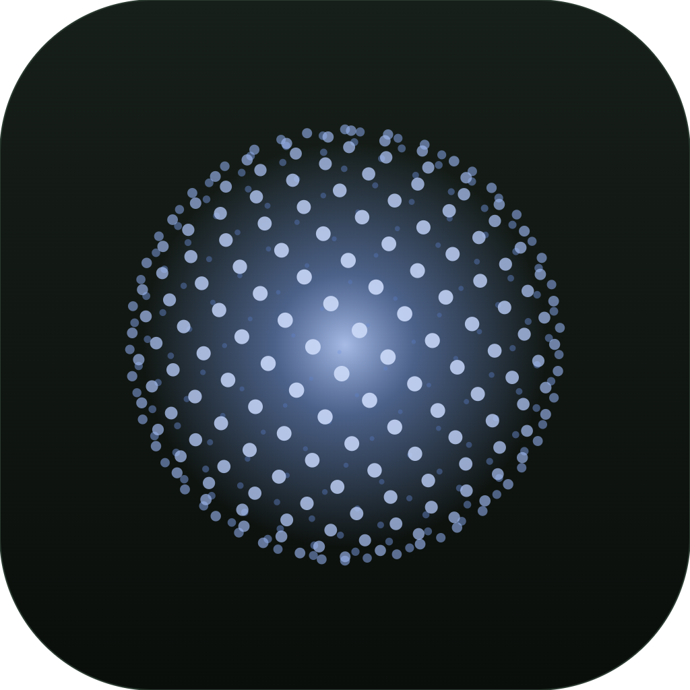
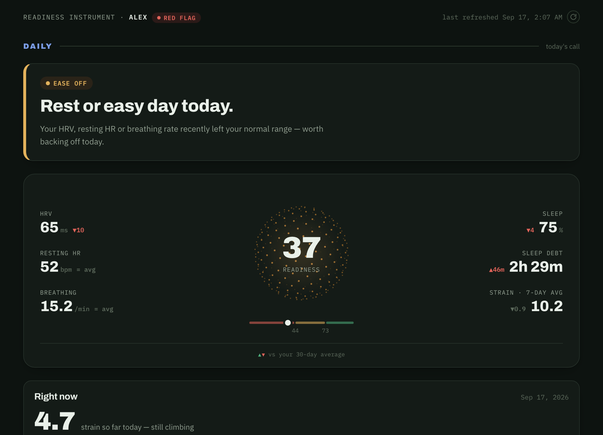
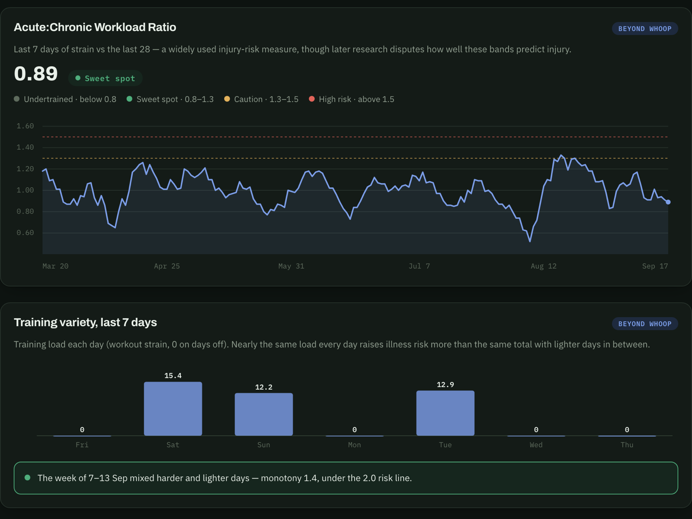
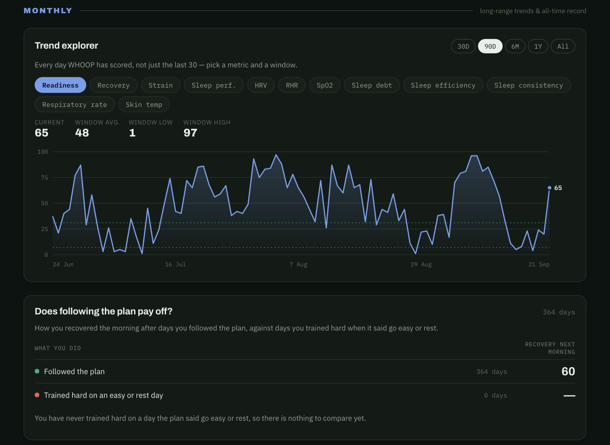
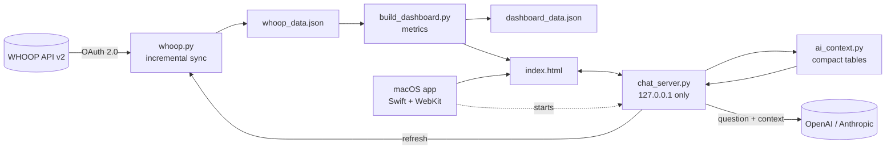

<div align="center">



# WHOOP Dashboard

**A private, data-first training dashboard built on your own WHOOP data.**
Sports-science metrics the WHOOP app doesn't show, a daily training call you can
check line by line, and an AI chat that knows your entire history.

[](https://github.com/jpselwan123/whoop-dashboard/actions/workflows/ci.yml)
[](LICENSE)




<sub>All screenshots use the built-in synthetic demo athlete — no real health data.</sub>

</div>

---

## Contents

- [Why this exists](#why-this-exists)
- [Features](#features)
- [Try it in 30 seconds (no WHOOP needed)](#try-it-in-30-seconds-no-whoop-needed)
- [Setup with your WHOOP](#setup-with-your-whoop)
- [AI chat](#ai-chat)
- [How the numbers work](#how-the-numbers-work)
- [Architecture](#architecture)
- [Privacy & security](#privacy--security)
- [Development](#development)
- [Limitations](#limitations)
- [License & disclaimer](#license--disclaimer)

## Why this exists

The WHOOP app tells you *what* your recovery and strain are. It doesn't tell you
whether your training load is ramping too fast, whether this week has been
hard-every-day, which sport actually costs you the most recovery, or *why* today is
a good or bad day to push — in numbers you can check.

This dashboard pulls your full history straight from the official WHOOP API and
answers those questions. Every call it makes shows the exact numbers and thresholds
behind it, calibrated to **your own** history rather than generic cut-offs.

## Features

### Daily — today's call
- **Readiness — how ready you are to train today**, one 0–100 number that sets the
  day's answer: **Push · Train · Go easy · Rest**. It starts from your body's trend and is
  lowered when a warning sign or today's context calls for it.
- **Click the orb** to see every input next to its normal range, anything
  that lowered readiness today, and the four bands.
- **Today's plan** — which kind of session fits today, based on how *you* have
  recovered from each sport before.
- **Fatigue signal** — flags nights when HRV, resting heart rate, or breathing rate
  leave your personal normal range.

### Weekly — load and injury-risk signals



- **Acute:Chronic Workload Ratio** with safe / caution / high-risk bands.
- **Training variety** (Foster monotony) — warns when a week has been unusually
  hard-every-day *for you*.
- Heart-rate zone time, sessions per week, training mix, sleep composition,
  day-of-week patterns — all on Monday–Sunday weeks.

### Monthly — long-range trends



- **Recovery calendar heatmap** of every day on record.
- **Monthly averages** that show real gaps and fade partial months instead of
  hiding them.
- **Next-morning recovery after each sport** — what each sport typically costs you.
- Trend explorer for any metric, personal records, and the full training log.

### App experience
- **Native macOS app** (Swift + WebKit) that refreshes on launch.
- **Manual refresh** button — nothing updates behind your back.
- **AI chat** with full-history context (OpenAI or Claude), conversation memory,
  and a draggable panel.
- Works on phone-width screens, respects *Reduce Motion*, no external JS libraries.

Items marked **Beyond WHOOP** in the app are metrics the WHOOP app doesn't provide.

## Try it in 30 seconds (no WHOOP needed)

Requires Python 3.9+ (preinstalled on recent macOS). No packages to install.

```bash
git clone https://github.com/jpselwan123/whoop-dashboard.git ~/whoop
cd ~/whoop
python3 scripts/generate_demo_data.py demo   # synthetic athlete, 420 days
python3 build_dashboard.py demo
open demo/index.html
```

## Setup with your WHOOP

### 1. Create a WHOOP developer app

1. Sign in at [developer.whoop.com](https://developer.whoop.com) and create an app.
2. Add a redirect URI. The default this project uses is
   `https://localhost:8080/callback` (set `WHOOP_REDIRECT_URI` in `.env` to use another).
3. Select the scopes: `read:recovery`, `read:cycles`, `read:sleep`, `read:workout`,
   `read:profile`, `read:body_measurement`.
4. Copy the **Client ID** and **Client Secret**.

### 2. Configure

```bash
cd ~/whoop
cp .env.example .env
```

Put your Client ID and Client Secret into `.env`.

### 3. Authorize once

```bash
python3 whoop.py --auth-url
```

Open the printed link, approve access, then copy the `code=` value from the address
bar you land on (the page itself may not load — that's expected) into
`WHOOP_AUTH_CODE` in `.env`. The code is single-use and expires within minutes.

### 4. First pull

```bash
./refresh.sh          # = python3 whoop.py && python3 build_dashboard.py
open index.html
```

The first run downloads your full history. After that, a refresh token is stored in
`whoop_tokens.json`, the auth code is never needed again, and each refresh only
re-fetches the last 10 days (to catch late score corrections).

### 5. Native macOS app (optional)

```bash
./native_app/build.sh
mv "native_app/build/WHOOP Dashboard.app" /Applications/
```

The app expects the project at `~/whoop`. It isn't signed with a paid Apple
Developer ID, so the **first time**, right-click the app and choose **Open**, then
confirm. After that it opens normally.

## AI chat

Click the pulse icon (bottom right) to ask anything about your data — *"How does
soccer affect my next-day HRV?"*, *"Compare my sleep this month to last month"*,
*"Why was I flagged today?"*

| | OpenAI (default) | Anthropic |
|---|---|---|
| Model | `gpt-5.6-luna` | `claude-sonnet-5` |
| `.env` | `OPENAI_API_KEY=…` | `AI_PROVIDER=anthropic`<br>`ANTHROPIC_API_KEY=…` |
| Key from | [platform.openai.com](https://platform.openai.com/api-keys) | [console.anthropic.com](https://console.anthropic.com) |

- **Full context, compact.** Your whole history is sent as compact tables (every
  day, sleep, and workout plus the dashboard's computed numbers) — roughly 90% smaller
  than the raw WHOOP export. It stays well below the 272K-token
  point where OpenAI's long-context pricing starts.
- **Cheap.** With `gpt-5.6-luna` ($0.20 / 1M input tokens, $0.02 cached), a question
  typically costs around a cent; follow-ups reuse the cached context.
- **Conversation memory** within the open chat; the pencil icon starts a new one.
- **Key changes apply immediately** — `.env` is re-read on every question.
- Clear, plain-English errors for a missing/invalid key, no credit, rate limits,
  timeouts, and connection problems.

Set a monthly spending limit in your provider's billing settings. Model and
reasoning effort are configurable: `OPENAI_MODEL`, `OPENAI_REASONING_EFFORT`,
`ANTHROPIC_MODEL`.

## How the numbers work

Everything is computed from your own history. Thresholds adapt to you.

| Metric | Definition | Flags at |
|---|---|---|
| **Readiness** | Half last night, half recent trend (7-day HRV (ln RMSSD) and resting HR, 3-night sleep hours vs needed) — each vs your previous 60 days, equal weights (see [below](#how-readiness-is-calculated)) | Above normal 63+ (½ SD above) · below normal under 38 · Recovery under 38 (½ SD below) |
| **Load ratio (ACWR)** | Average strain over the last 7 calendar days ÷ last 28 (needs 21+ days of data in the window) | Safe 0.8–1.3 · Caution 1.3–1.5 · High > 1.5 |
| **Training variety** | Foster monotony (weekly mean ÷ SD of daily strain) × weekly load | This week above 80% of your last 16 weeks |
| **Fatigue signal** | Each night's HRV, resting HR, and breathing rate vs the 30 days before it (needs 21+ nights recorded) | Outside ±1.5 standard deviations (shown in the app as plain limits, e.g. "flags at 16.4+ /min") |
| **Rest day** | A day in your bottom 15% of strain | 7+ days without one |
| **Sport recovery cost** | Average next-morning recovery after days whose hardest session was that sport, vs your overall average | Sports with 8+ sessions |

**Readiness is the answer.** It's one number for how ready you are to train today, and
the day's label comes straight from it:

| Readiness | Answer |
|---|---|
| 63+ | **Push** |
| 38–62 | **Train** |
| 25–37 | **Go easy** |
| under 25 | **Rest** |

It starts from your **body score** (below) and can only be *lowered* by today's context:

- **At most 37 → 24** — a *confirmed* warning sign: the same vital (HRV, resting HR, or
  breathing rate) past its line on 2 of the last 3 nights, or 2+ vitals past it on the same
  night, and still past it last night. Just over the line → at most 37; a full SD further
  or more → at most 24. A one-off night is only shown as *watching* — single nights brushing
  the line are common noise, and wearable illness detection relies on changes across
  several nights ([Miller et al., 2020](https://pubmed.ncbi.nlm.nih.gov/33301493/)).
- **Sessions today** — each workout logged today is classed easy, moderate or hard, following
  the three recovery time courses in [Stanley, Peake & Buchheit, 2013](https://link.springer.com/article/10.1007/s40279-013-0083-4)
  (cardiac autonomic recovery: up to 24 h after low-intensity, 24–48 h after threshold-intensity,
  48 h+ after high-intensity exercise):

  | Session | Rule (WHOOP heart-rate zones, strain) | Readiness for the rest of today |
  |---|---|---|
  | Easy | anything below moderate | no change |
  | Moderate | 20+ min in zones 3–5, or strain 10+ | at most 62 (no Push) |
  | Hard | 10+ min in zones 4–5, or strain 14+ — or today's total strain above your 7-day average | at most 37 |

  The heart-rate zone chart uses the same split: zones 0–2 easy, zone 3 moderate, zones 4–5 hard.

  The strain lines are WHOOP's own scale (10–13.9 moderate, 14+ high); the minute lines and
  treating zone 3 / zones 4–5 as roughly "threshold" / "above threshold" are design choices.
- **At most 37** — all three of 7+ days since rest, a week harder than 80% of recent weeks,
  and ACWR above 1.3.

### How readiness is calculated

Readiness and WHOOP recovery are different numbers. Readiness asks the two questions
HRV-guided training studies act on: **how did last night compare with your normal, and is
your recent trend inside, above, or below it?** Each counts for half.

| Step | What happens | Evidence |
|---|---|---|
| 1. Smooth (trend half) | 7-day rolling average of ln(RMSSD) HRV and of resting HR; 3-night average of sleep **hours vs needed** (time asleep ÷ WHOOP's sleep need — not WHOOP's Sleep Performance, which since WHOOP's 2025 update also blends in consistency, efficiency and sleep stress) | The 7-day rolling ln RMSSD average is what HRV-guided training trials act on ([Javaloyes et al., 2019](https://pubmed.ncbi.nlm.nih.gov/29809080/); [Carrasco-Poyatos et al., 2020](https://pmc.ncbi.nlm.nih.gov/articles/PMC7432021/)). Sleep loss impairs performance ([Fullagar et al., 2015](https://pubmed.ncbi.nlm.nih.gov/25315456/); [Walsh et al., 2021](https://www.researchgate.net/publication/345351246_Sleep_and_the_athlete_narrative_review_and_2021_expert_consensus_recommendations)); the 3-night window is a design choice |
| 2. Compare to *your* normal | Baseline = your rolling values over the 60 days before this week. Normal range = baseline mean ± 0.5 SD | ±0.5 SD is the "smallest worthwhile change" these trials use to choose hard vs easy days (mean ± 0.5 × SD, following Plews et al., 2012 — see [Carrasco-Poyatos et al., 2020](https://pmc.ncbi.nlm.nih.gov/articles/PMC7432021/)). Trials used a ~4-week baseline; 60 days is a steadier choice for everyday life |
| 3. Add resting HR and sleep | Each input expressed in SD units (resting HR flipped: lower = better), capped at ±3 | Adding resting HR (and well-being) to HRV gave the largest gains in a 2025 cyclist trial ([Alfonso et al., 2025](https://pmc.ncbi.nlm.nih.gov/articles/PMC12485039/)) |
| 4. Last night (other half) | The same three markers from last night alone, vs the single nights of your previous 60 days. Naps taken after waking count toward sleep: their sleep time is added to last night's hours vs needed, capped at 100% — a nap restores performance, most clearly after a short night ([Botonis et al., 2021](https://onlinelibrary.wiley.com/doi/10.1111/sms.14060)) | Averaging hides individual next-day responses; single-day values are recommended for short-term responses ([Schneider et al., 2019](https://pmc.ncbi.nlm.nih.gov/articles/PMC6538885/)), and the first HRV-guided trial decided each day from that morning's HRV ([Kiviniemi et al., 2007](https://pubmed.ncbi.nlm.nih.gov/17849143/)). Acute sleep loss (6 h or less) lowers exercise performance by ~8% on average ([Craven et al., 2022](https://pubmed.ncbi.nlm.nih.gov/35708888/)) |
| 5. Combine | Equal-weight average within each half, then **50% last night + 50% trend** → score = 50 + 25 × average, 0–100 | Single nights are noisy and can mislead on their own ([Plews et al., 2012](https://link.springer.com/article/10.1007/s00421-012-2354-4)); rolling averages lose next-day detail (Schneider 2019). No study has validated a split or specific weights, and the 2021 meta-analysis calls daily vs rolling an open question ([Manresa-Rocamora et al., 2021](https://pubmed.ncbi.nlm.nih.gov/34639599/)) — so equal weights, the robust default when none exist ([Dawes, 1979](https://www.researchgate.net/publication/232597503_The_robust_beauty_of_improper_linear_models_in_decision_making)) |
| 6. Bands | 63+ Push (≥ +0.5 SD) · 38–62 Train · 25–37 Go easy (< −0.5 SD) · under 25 Rest (< −1 SD) | ±0.5 SD is the trials' above / within / below rule; the −1 SD Rest line, the 2-of-3-nights rule, and the 37 / 24 caps are design choices |

**What it deliberately leaves out**
- **Training load (ACWR).** Its ability to predict injury is disputed
  ([Impellizzeri et al., 2020](https://www.researchgate.net/publication/341936245_AcuteChronic_Workload_Ratio_Conceptual_Issues_and_Fundamental_Pitfalls)),
  so load, rest days, and illness-type signals (breathing rate —
  [Miller et al., 2020](https://pubmed.ncbi.nlm.nih.gov/33301493/); resting HR —
  [Radin et al., 2020](https://pubmed.ncbi.nlm.nih.gov/33334565/)) lower readiness instead of being hidden inside it.
- **How you feel.** Self-reported well-being is the most sensitive marker of training
  response ([Saw et al., 2016](https://pubmed.ncbi.nlm.nih.gov/26423706/)), but WHOOP's API
  doesn't provide it.

**Honest limits:** the method comes from endurance-athlete trials, WHOOP's HRV is measured
during sleep rather than on waking, and the equal weights (including the 50/50 split between
last night and the trend) are a principled default rather than a validated optimum. Until you have about 5 weeks of data, the page falls back to
WHOOP's recovery zones.

## Architecture



```
whoop-dashboard/
├── whoop.py                  # WHOOP OAuth + incremental data sync
├── build_dashboard.py        # all metrics; renders index.html from the template
├── dashboard_template.html   # the dashboard UI (vanilla JS + hand-built SVG charts)
├── chat_server.py            # local server: AI chat, refresh, data endpoint
├── ai_context.py             # full history → compact tables for the AI model
├── env_config.py             # .env loader + atomic file writes
├── refresh.sh                # pull + build in one step
├── CLAUDE.md                 # conventions for AI coding agents
├── native_app/               # macOS app (main.swift, build.sh, icon)
├── scripts/
│   ├── generate_demo_data.py # synthetic WHOOP export for demo + tests
│   └── privacy_scan.py       # blocks commits containing personal data
├── tests/                    # unit tests (no network, no secrets)
└── docs/screenshots/
```

**Design choices**
- **Zero dependencies** — Python standard library and plain browser APIs only.
  Nothing to install, nothing to go out of date.
- **Crash-safe writes** — every data file is written to a temp file and atomically
  renamed, so a force-quit can't corrupt your history or OAuth tokens.
- **Fail-safe UI** — animations never gate visibility; an empty or brand-new account
  shows clear "not enough data yet" states instead of broken charts.

## Privacy & security

- **Local-first.** Your data is stored only on your Mac. The only network calls go to
  WHOOP (to fetch your data) and — only when you ask the chat something — to the AI
  provider you configured.
- **Secrets never leave the backend.** API keys are read by the local server and never
  reach the web page. The server listens on `127.0.0.1` only.
- **What the chat sends:** your history as tables plus the conversation. It does
  **not** include your email, last name, WHOOP user ID, or record IDs. OpenAI requests
  are sent with `store: false`. Conversations are kept only in the open window.
- **Nothing personal is committed.** `.env`, `whoop_tokens.json`, and all generated
  data files are git-ignored. Tests and screenshots use synthetic data only.

See [SECURITY.md](SECURITY.md) to report a vulnerability.

## Development

```bash
python3 -m unittest discover -s tests -t tests -v
```

The test suite runs on synthetic data against a fake AI provider — no network, no
API keys, no cost. It covers metric calculations and edge cases (no workouts, missing
vitals, brand-new accounts), the privacy of the AI context, and the chat backend's
request format, conversation handling, input validation, and error messages.
GitHub Actions runs it on Python 3.9 and 3.12 and compiles the macOS app on every
push.

Before publishing changes, run the privacy scan — it fails if any tracked file contains
a value from your `.env`, your WHOOP tokens, identifiers from your own WHOOP export, or a
home-directory path:

```bash
python3 scripts/privacy_scan.py
```

`CLAUDE.md` documents the codebase conventions for AI coding agents.

## Limitations

- The native app is macOS-only; the dashboard itself works in any modern browser.
- The app isn't notarized (that needs a paid Apple Developer account), hence the
  one-time right-click → Open.
- The local server uses port `8934`; if something else uses it, change `PORT` in
  `chat_server.py` and the matching URLs in `dashboard_template.html`.
- Sport and weekday comparisons are correlations, not controlled experiments.

## License & disclaimer

[MIT](LICENSE).

This is an independent personal project. It is **not affiliated with, endorsed by,
or supported by WHOOP, Inc.** "WHOOP" is a trademark of WHOOP, Inc., used here only
to describe compatibility with its public API.

This software is for fitness self-tracking and **is not medical advice**. It does not
diagnose, treat, or prevent any condition. Talk to a qualified professional about
health concerns.
